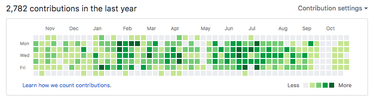
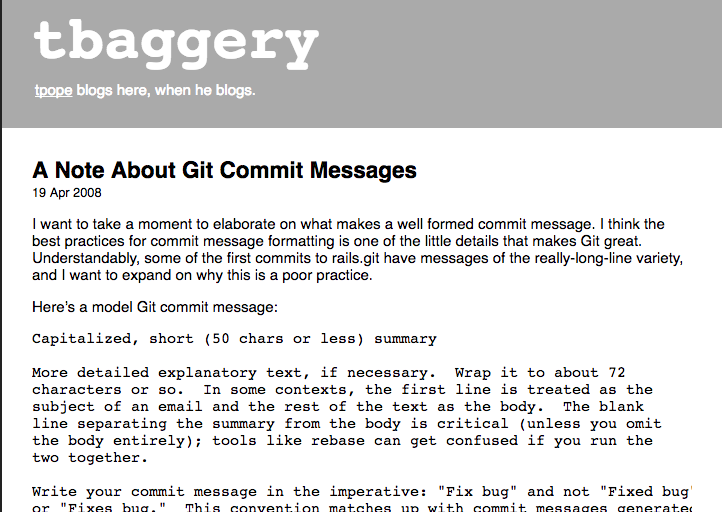
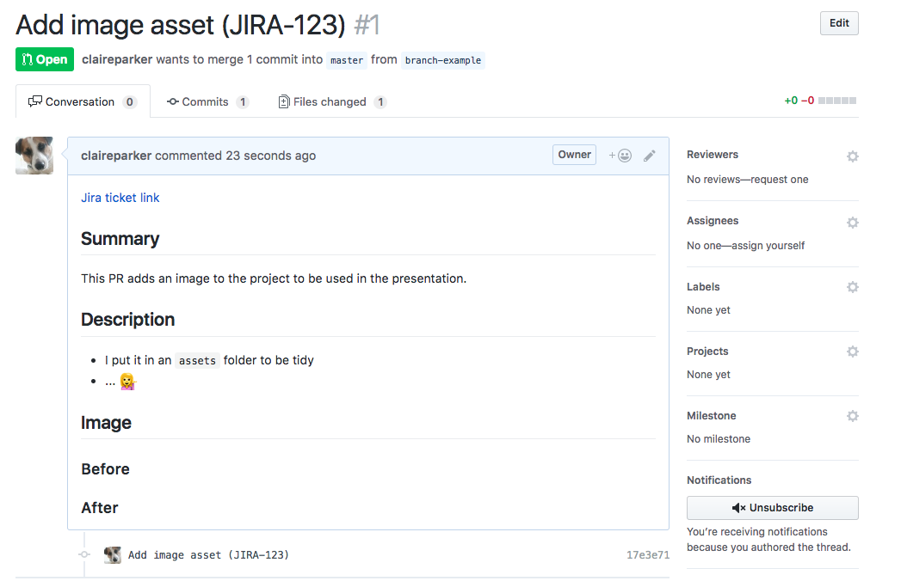

@title[Title]

## Committing to Committing

🤗🤗🤗🤗🤗🤗

### Let's talk about commit messages and pull requests

#### Claire Parker-Jones

---
@title[Disclaimer 1]

## 🚨 Disclaimer 1

Note:
How to write commit messages and pull requests is a very opinionated subject. What I am about to present to you is only my advice, so feel free to discard all of it. Although hopefully you'll pick up something useful.

---
@title[Disclaimer 2]

## 🚨 Disclaimer 2

Note:
I'm a frontend developer. I work on projects rather than BAU. Not everything may apply to you.
---
@title[Who cares]

## PRs and commit messages - who cares?

Note:
Pull requests are the 2nd to last thing you do before finishing a ticket - the last thing is update your Jira ticket. Pull requests and commit messages are often rushed and done as an afterthought. Work for 3 hours, add everything in 1 commit and push. You don't win internet points for doing them "well". I want you to consider them an important part of the development process, as much as maintainable, readable, efficient code.
---
@title[Because]

## Because ...

- Code reviewers will thank you |
- PRs are merged quicker |
- Documentation for other developers ✨in the future✨ |
- And yourself ✨in the future✨ |

Note:
Why? I think they are really important because ... saves people time. Helps future developers. Pay it forward - no direct benefit but benefits the team in the long run, just like well written code.
---
@title[Writing Commit Messages 1]

## Commit messages
### Some tips

Atomic commits

- Single purpose commits: contain one task or fix |
- Easy to debug and revert out |
- Especially with `git bisect` |
- Helps you work more methodically |

Note:
What is an atomic commit? It's not atomic when you use the word "and". They make your GitHub dashboard look great

---
@title[Writing Commit Messages 2]

## Commit messages
### Some tips

Atomic commits

Makes your Github dashboard look awesome

Note:
Which of course is a true measure of how good a developer you are. (sarcasm)

---

@title[Writing Commit Messages 3]

## Commit messages
### How to write them

[http://tbaggery.com/2008/04/19/a-note-about-git-commit-messages.html](http://tbaggery.com/2008/04/19/a-note-about-git-commit-messages.html)

Note:
This is the closest thing I have to a rule. This is a generally accepted convention for writing commit messages, even in Ampersand. Keep the title to 72 characters. Add a Jira ticket number. More explanation in a new paragraph underneath. Git and Github truncate longer ones. Your editor can help with this.

---

@title[Writing PRs 1]

## Writing Pull Requests

What's the purpose of a PR?
- to let other developers know what you've done |

Note:
So make it clear and easy to read. They are for developers so can be written technically.

---

@title[Writing PRs 2]

## Writing Pull Requests

- Jira ticket link |
- What: Summary of what your work does |
- Why & How: More detailed explanation (optional) |
- Images (optional) |

Note:
There may be a template on your project, if not you could use something like this.
---

@title[Writing PRs 2a]

## Writing Pull Requests

---

@title[Writing PRs 3]

## Formatting Pull Requests

- Everyone |
- Loves |
- Bullet |
- Points |
- Use headings, emphasis and line breaks
- And whitespace |

Note:
Formatting is also important. Learn markdown

---
@title[Writing PRs 4]

## Writing Pull Requests

Visual change? Don't forget to add a:

- Screenshot: before & after states
- Screen capture [Recordit](http://recordit.co/)

Note:
Screenshots are excellent documentation of how the site looked in case it breaks. Keep screen captures short and sweet.

---

@title[Wrapping Up]

Always keep learning and improving your style.

Be nosey and see what other developers do.

Note:
Look at PRs on repos or through the dashboard.

---

@title[Be nice]

# Be nice 🙂

Note:
Final thought: every line of code was written with good intentions by someone trying to do a good job. Encouragement and support and sharing your knowledge is an important part of any job that ultimately only benefits you and your team. Remember to be nice and log your time.
